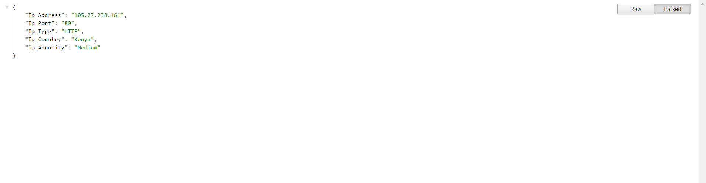

# Proxy API
> Gets HTTP, HTTPS,SOCKS Proxy




## Usage

Endpoints:

```sh
https://http-https-socks-proxy.herokuapp.com/get_http_proxy
```
```sh
https://http-https-socks-proxy.herokuapp.com/get_https_proxy
```
```sh
https://http-https-socks-proxy.herokuapp.com/get_socks_proxy
```


## Usage example

Make request to any of above endpoint and get working proxy

## Short Notice

All Proxy Get Updated Every 30 mins


Distributed under the MIT license. See ``LICENSE`` for more information.

[https://github.com/PrasadBroo/http-https-socks-proxy](https://github.com/PrasadBroo/)

## Contributing

1. Fork it (<https://github.com/PrasadBroo/http-https-socks-proxy/fork>)
2. Commit your changes (`git commit -am 'some changes made'`)
4. Push to the branch (`git push origin master`)
5. Create a new Pull Request

<!-- Markdown link & img dfn's -->
[travis-image]: https://img.shields.io/travis/dbader/node-datadog-metrics/master.svg?style=flat-square
[travis-url]: https://travis-ci.org/dbader/node-datadog-metrics
[wiki]: https://github.com/PrasadBroo/http-https-socks-proxy

